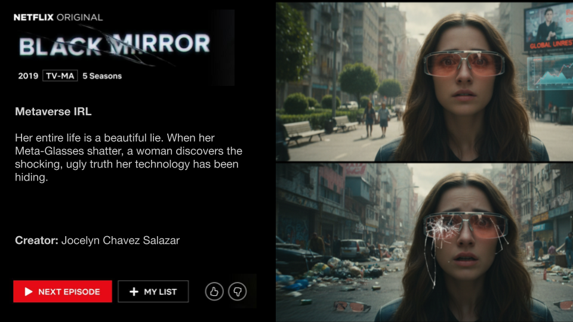

In this podcast we create our own Black Mirror inspired episodes using current rising technologies. We use Meta-Glasses, self-driving cars, and deepfake technologies to as our main tools gone bad. Featuring Dylan-Dirac Nintunze and Marwa Idris.

