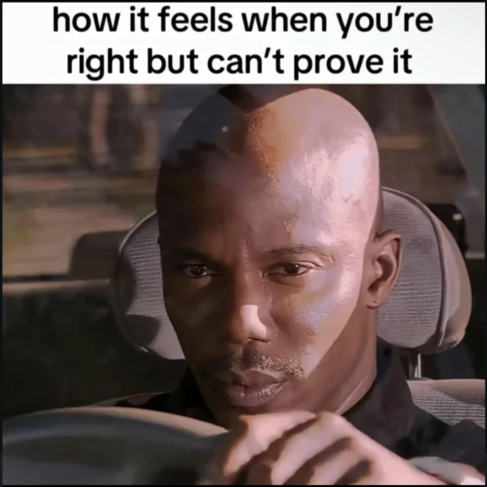

In this podcast we talk about the article "Meme Aesthetics" by Stephen Best, Mia You, and Damon Ross Young, and use it to discuss how meaning behind memes are created, recognized, and communicated. We also consider how these insights might shape the way we communicate or interpret information outside of a digital landscape. Below you will find the memes mentioned that were not included in the article. Featuring Dylan-Dirac Nintunze and Marwa Idris.

